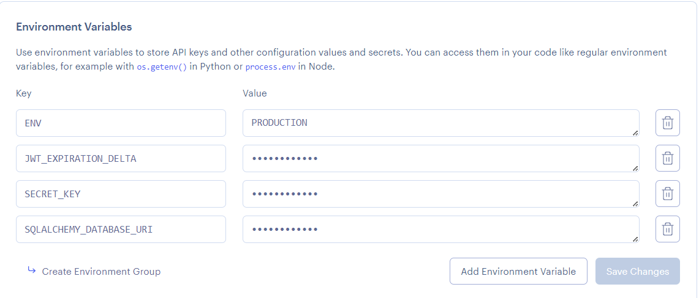

# ID: 816034409
# Student Conduct Tracker
# Description
Staff system for recording positive and negative experiences with students.

# CLI Commands

# Staff Commands
- Add Student  
  Usage: flask staff add <student_id> <first_name> <last_name> <programme> <faculty>

- Search Student  
  Usage: flask staff search <student_id>

- List All Students  
  Usage: flask staff listStudents

# Review Commands
- Create a Review
  Usage: flask review create <review_id> <student_id> <staff_id> <review_type> <comment>

- View Student Reviews  
  Usage: flask review viewreviews <student_id>


[](https://gitpod.io/#https://github.com/uwidcit/flaskmvc)
<a href="https://render.com/deploy?repo=https://github.com/uwidcit/flaskmvc">
  
</a>


# Flask MVC Template
A template for flask applications structured in the Model View Controller pattern [Demo](https://dcit-flaskmvc.herokuapp.com/). [Postman Collection](https://documenter.getpostman.com/view/583570/2s83zcTnEJ)


# Dependencies
* Python3/pip3
* Packages listed in requirements.txt

# Installing Dependencies
```bash
$ pip install -r requirements.txt
```

# Configuration Management


Configuration information such as the database url/port, credentials, API keys etc are to be supplied to the application. However, it is bad practice to stage production information in publicly visible repositories.
Instead, all config is provided by a config file or via [environment variables](https://linuxize.com/post/how-to-set-and-list-environment-variables-in-linux/).

## In Development

When running the project in a development environment (such as gitpod) the app is configured via default_config.py file in the App folder. By default, the config for development uses a sqlite database.

default_config.py
```python
SQLALCHEMY_DATABASE_URI = "sqlite:///temp-database.db"
SECRET_KEY = "secret key"
JWT_ACCESS_TOKEN_EXPIRES = 7
ENV = "DEVELOPMENT"
```

These values would be imported and added to the app in load_config() function in config.py

config.py
```python
# must be updated to inlude addtional secrets/ api keys & use a gitignored custom-config file instad
def load_config():
    config = {'ENV': os.environ.get('ENV', 'DEVELOPMENT')}
    delta = 7
    if config['ENV'] == "DEVELOPMENT":
        from .default_config import JWT_ACCESS_TOKEN_EXPIRES, SQLALCHEMY_DATABASE_URI, SECRET_KEY
        config['SQLALCHEMY_DATABASE_URI'] = SQLALCHEMY_DATABASE_URI
        config['SECRET_KEY'] = SECRET_KEY
        delta = JWT_ACCESS_TOKEN_EXPIRES
...
```

## In Production

When deploying your application to production/staging you must pass
in configuration information via environment tab of your render project's dashboard.



# Flask Commands

wsgi.py is a utility script for performing various tasks related to the project. You can use it to import and test any code in the project. 
You just need create a manager command function, for example:

```python
# inside wsgi.py

user_cli = AppGroup('user', help='User object commands')

@user_cli.cli.command("create-user")
@click.argument("username")
@click.argument("password")
def create_user_command(username, password):
    create_user(username, password)
    print(f'{username} created!')

app.cli.add_command(user_cli) # add the group to the cli

```

Then execute the command invoking with flask cli with command name and the relevant parameters

```bash
$ flask user create bob bobpass
```
staff_cli = AppGroup('staff', help='Staff object commands')

# Command to add students - Add Student
@staff_cli.command("add", help="Add a student")
@click.argument("student_id", type=int)
@click.argument("first_name", type=str)
@click.argument("last_name", type=str)
@click.argument("programme", type=str)
@click.argument("faculty", type=str)
def add_student_command(student_id, first_name, last_name, programme, faculty):
    add_student(student_id, first_name, last_name, programme, faculty)
    print(f'Student {first_name} {last_name} added!')

Then execute the command invoking with flask cli with command name and the relevant parameters

```bash
$ flask staff add 123 Jake Blue "Computer Science" "FST"
```
# command to search for a student using student ID - Search Student
# Returns student name and their reviews
@staff_cli.command("search", help="Search a student by ID and Name")
@click.argument("student_id", type=int)
def search_student_command(student_id):
    student = search_student(student_id)
    if student:
        print(f"Student found: {student.firstName} {student.lastName}, ID: {student.studentID}")
        reviews = student.reviews
        if reviews:
            print("Reviews:")
            for review in reviews:
                print(f"- {review.reviewType}: {review.comment} (Staff ID: {review.staffID})")
        else:
            print("No reviews found for this student.")
    else:
        print(f"No student found with ID {student_id}.")

app.cli.add_command(staff_cli)  # adds staff group to the cli

Then execute the command invoking with flask cli with command name and the relevant parameters

```bash
$ flask staff search 123
```
# extra command that lists all students added and their information
@staff_cli.command("listStudents", help="List all students in the system")
def list_students_command():
    students = get_all_students()
    if students:
        for student in students:
            print(f"Student ID: {student.studentID}")
            print(f"Name: {student.firstName} {student.lastName}")
            print(f"Programme: {student.programme}")
            print(f"Faculty: {student.faculty}")
            print("-----------")  # Separator between students
    else:
        print("No students found in the system.")

app.cli.add_command(staff_cli)  # adds staff group to the cli

Then execute the command invoking with flask cli with command name and the relevant parameters

```bash
$ flask staff listStudents
```

review_cli = AppGroup('review', help='Review related commands')

# command that adds/creates a new review - Review Student
@review_cli.command("create", help="Create a new review")
@click.argument("review_id", type=int)
@click.argument("student_id", type=int)
@click.argument("staff_id", type=int)
@click.argument("review_type", type=str)
@click.argument("comment", type=str)
def create_review_command(review_id, student_id, staff_id, review_type, comment):
    review = add_review(review_id, student_id, staff_id, review_type, comment)
    if review:
        print(f"Review for student {student_id} created!")
    else:
        print("Failed to create review.")

app.cli.add_command(review_cli)  # adds review group to the cli

Then execute the command invoking with flask cli with command name and the relevant parameters

```bash
$ flask review create 100 123 001 "Positive" "Good at participation."
```
# command that views all reviews for a specific student - View Student Reviews
@review_cli.command("viewreviews", help="View all reviews for a student")
@click.argument("student_id", type=int)
def view_reviews_command(student_id):
    reviews = view_reviews(student_id)
    if reviews:
        for review in reviews:
            print(f"Review ID: {review.reviewID}")
            print(f"Staff ID: {review.staffID}")
            print(f"Review Type: {review.reviewType}")
            print(f"Comment: {review.comment}")
            print("-----------")  # Separator between reviews
    else:
        print(f"No reviews found for student with ID {student_id}.")

app.cli.add_command(review_cli)  # adds review group to the cli

Then execute the command invoking with flask cli with command name and the relevant parameters

```bash
$ flask review viewreviews 123
```

# Running the Project

_For development run the serve command (what you execute):_
```bash
$ flask run
```

_For production using gunicorn (what the production server executes):_
```bash
$ gunicorn wsgi:app
```

# Deploying
You can deploy your version of this app to render by clicking on the "Deploy to Render" link above.

# Initializing the Database
When connecting the project to a fresh empty database ensure the appropriate configuration is set then file then run the following command. This must also be executed once when running the app on heroku by opening the heroku console, executing bash and running the command in the dyno.

```bash
$ flask init
```

# Database Migrations
If changes to the models are made, the database must be'migrated' so that it can be synced with the new models.
Then execute following commands using manage.py. More info [here](https://flask-migrate.readthedocs.io/en/latest/)

```bash
$ flask db init
$ flask db migrate
$ flask db upgrade
$ flask db --help
```

# Testing

## Unit & Integration
Unit and Integration tests are created in the App/test. You can then create commands to run them. Look at the unit test command in wsgi.py for example

```python
@test.command("user", help="Run User tests")
@click.argument("type", default="all")
def user_tests_command(type):
    if type == "unit":
        sys.exit(pytest.main(["-k", "UserUnitTests"]))
    elif type == "int":
        sys.exit(pytest.main(["-k", "UserIntegrationTests"]))
    else:
        sys.exit(pytest.main(["-k", "User"]))
```

You can then execute all user tests as follows

```bash
$ flask test user
```

You can also supply "unit" or "int" at the end of the comand to execute only unit or integration tests.

You can run all application tests with the following command

```bash
$ pytest
```

## Test Coverage

You can generate a report on your test coverage via the following command

```bash
$ coverage report
```

You can also generate a detailed html report in a directory named htmlcov with the following comand

```bash
$ coverage html
```

# Troubleshooting

## Views 404ing

If your newly created views are returning 404 ensure that they are added to the list in main.py.

```python
from App.views import (
    user_views,
    index_views
)

# New views must be imported and added to this list
views = [
    user_views,
    index_views
]
```

## Cannot Update Workflow file

If you are running into errors in gitpod when updateding your github actions file, ensure your [github permissions](https://gitpod.io/integrations) in gitpod has workflow enabled 

## Database Issues

If you are adding models you may need to migrate the database with the commands given in the previous database migration section. Alternateively you can delete you database file.
